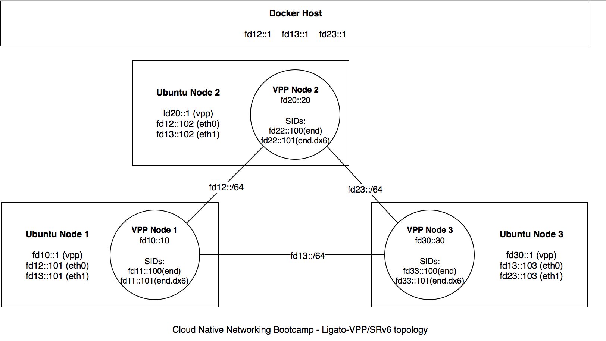
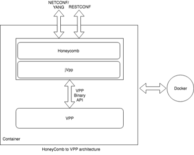
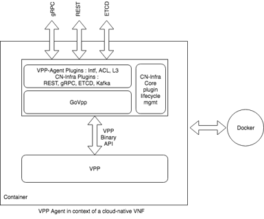
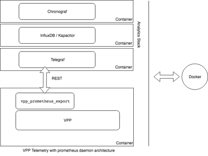
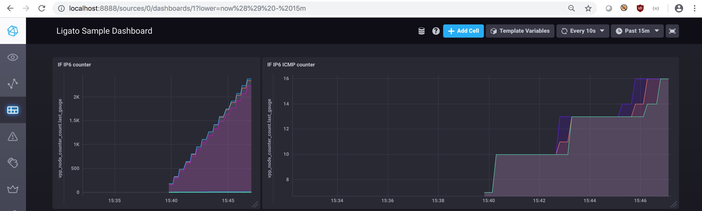
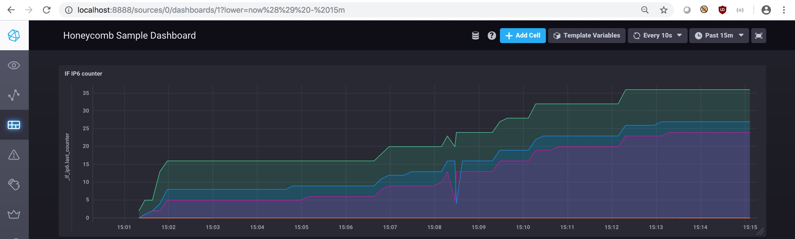
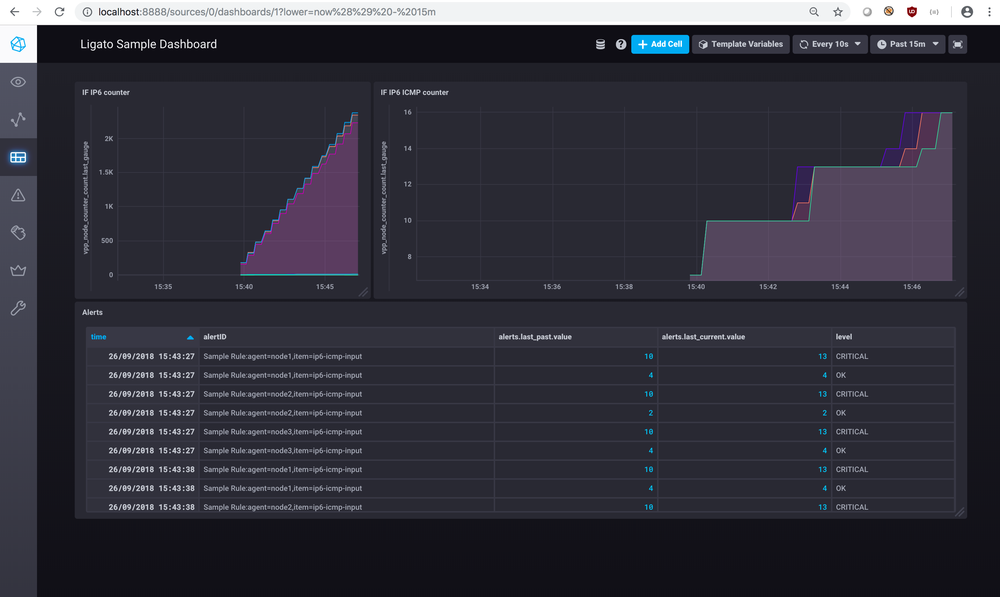
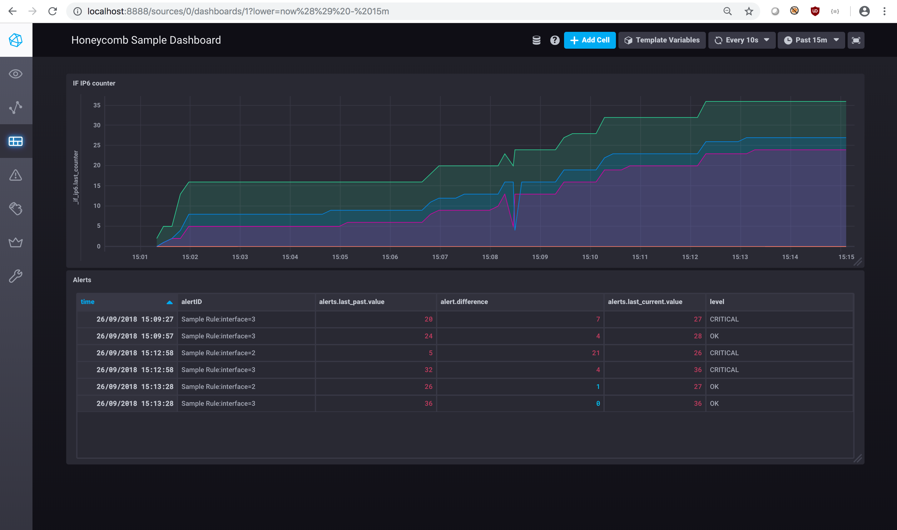

<!--
Copyright (c) 2018 Cisco Systems
Author: Steven Barth <stbarth@cisco.com>
Author: Cristina Precup <cprecup@cisco.com>
-->

# VPP SRv6 lab with Honeycomb and Ligato
This lab includes two containerized VPP SRv6 setups orchestrated using either Honeycomb (hc2vpp) or Ligato.

Honeycomb is a Java-based management agent that allows configuration of VPP using NETCONF / RESTCONF and (in the future) BGP. HC2VPP is a distribution of Honeycomb including (mostly standardized) YANG models to allow configuration of VPP similarly to other virtual routing and switching platforms ([see Honeycomb](https://wiki.fd.io/view/Honeycomb)).

Ligato is a cloud-native infrastructure including a control plane for VPP for implementing Virtual Network Functions (VNFs). Other projects include a controller for Service Function Chaining (SFC) and BGP ([see Ligato](https://ligato.io/)).

The intended topology is as follows.


## 0. Preliminary
You will need working versions of Docker & Docker Compose to run this demo as well as internet connectivity to retrieve and build containers.

You can run the labs also using Docker for Mac or Docker for Windows, for the latter you will also need the Git for Windows shell (Git Bash) to run the setup.sh script and the commands in this guide. In any case, make sure you have at least 4 GB of RAM assigned to your Docker engine (Settings -> Advanced).

You can follow this guide either using the Honeycomb (hc2vpp) or the Ligato lab, steps which apply to only one of the two are marked as such.

If you have previously started any of the two labs, please change into this labs directory and run
```
docker-compose down
```
to teardown and reset the environment.

Finally change into the directory of the lab you intend to run.

## 1. VPP Configuration Basics
VPP (Vector Packet Processing) is a highly-scalable open-source dataplane (see [What is VPP?](https://wiki.fd.io/view/VPP/What_is_VPP%3F)).
It primarily has a binary API (see [The VPP API](https://wiki.fd.io/view/VPP/The_VPP_API)) for configuration with bindings to programming languages like C, Go, Java and Python.

VPP however also has a CLI for debugging purposes which can be (ab)used to do  basic configuration. We will use this CLI to get acustomed to plain VPP (without Honeycomb or Ligato), however it is not meant for production use.

First we will bring up the basic VPP topology with the 3 nodes.

```
docker-compose up -d node1 node2 node3
```

### 1.1. Access the VPP CLI of node 1
```
docker-compose exec node1 vppctl
```

Note: To leave the VPP CLI use "quit".

### 1.2 List hardware interfaces and assigned addresses
On VPP CLI:
```
show hardware-interfaces
show interface
show interface addr
```

### 1.3 Creating TAP interfaces
You should see only an interface local0 in down-state. This means there are no usable interfaces configured right now. So let's change that!

VPP has different ways of working with interfaces. For best performance VPP can take ownership of (physical) interfaces such that all incoming and outgoing packets flow directly from / to VPP without interacting with the operating system's networking layer.

In this demo we do not want to impose dependencies on any hardware and want to work with standard Docker networking so we are working with virtual interfaces instead.

Each of our 3 VPP instances run inside a Ubuntu container, so to start we will
create a TAP-interface with one end on the Ubuntu side (called vpp9) and the other inside VPP (called tap9).

Note: You will not find this interface-pair in the topology diagram above.

On VPP CLI:
```
create tap id 9 hw-addr 00:00:00:00:99:99 host-ip6-addr fd99::1/64 host-if-name vpp9
```

This will create the interface and configure it with the address fd99::1 on the Ubuntu-side. It will also create the interface on the VPP side with a predefined MAC-address but it will be in the state down and without any IP addresses assigned. You can verify this using the show-commands from step 1.2

In the next step we will bring the interface up and configure it on the VPP-side.

On VPP CLI:
```
set interface state tap9 up
set interface ip address tap9 fd99::2/64
```

You can again verify the outcome with the commands from step 1.2.
As a result you should now be able to communicate from VPP to the host container running Ubuntu.

On VPP CLI:
```
ping fd99::1
```

While VPP is mostly a dataplane some minimal controlplane features are implemented such as ARP / NDP, thus pinging a neighbor on the same link will work automatically. You can also view the corresponding neighbor table.

On VPP CLI:
```
show ip6 neighbors
```

You can also verify the Ubuntu-side of things by opening a terminal to the shell of the Ubuntu node 1.

```
docker-compose exec node1 bash
```

Afterwards you can use the usual Linux commands to list interfaces or initiate a ping in the reverse direction.
```
ip addr list
ping6 fd99::2
```

## 2 Honeycomb configuration basics (Honeycomb lab only)
Note: If you are running the Ligato lab please skip ahead to section 3.



Honeycomb acts as a configuration store for VPP. It assumes to be the authoritative source of configuration and does not
read back changes made by other configuration methods such as the debug CLI.

Honeycomb exposes NETCONF and RESTCONF interfaces northbound with configuration data modeled in the YANG language. These three methods provide standardized exchanges in XML and JSON format for retrieving and manipulating configuration and retrieving operational data. You can find a quick overview over the three technologies and how they play together in [this DevNet presentation](https://www.netacad.com/sites/default/files/images/careers/Webinars/DevNet/devnet_session_7_networkprogrammability_yang_netconf_restconf.pdf).

Bring up the 3 VPP nodes and the graphical NETCONF explorer.

```
docker-compose up -d node1 node2 node3 anx
```

Note: If you have trouble starting / building the ANX container, make sure the git submodule is cloned correctly:
```
git submodule init
git submodule update
```

Point your browser at port 9269 of your docker host, e.g. http://localhost:9269 if you are running Docker for Windows or Docker for Mac. You should see the login screen of the "Advanced Netconf Explorer".

Fill out the Advanced Netconf Explorer login screen:
```
NETCONF device:     node1:2831
Username:           admin
Password:           admin
```
Then click the button *Login*.

You can now view the YANG models in both source and tree form and show the configuration and operational data corresponding to the models. You will notice again that the data is mostly empty for now.

### 2.1 Creating a host-interface for VPP communication using NETCONF
You can now create an interface for communication between containers. We attach VPP to an existing interface on the Docker topology. This is called a host-interface or AF_PACKET-interface. Explicitly we are connecting VPP to the interface *eth0* of the underlying container node1 which is connected to the interface with the same name on node2.

Enter the *NETCONF console* by clicking the respective button in the upper left area of the main screen of *Advanced Netconf Explorer*. 

Copy the NETCONF command in the upper textfield:
```
<edit-config xmlns="urn:ietf:params:xml:ns:netconf:base:1.0">
  <target><candidate/></target>
  <config>
    <interfaces xmlns="urn:ietf:params:xml:ns:yang:ietf-interfaces">
      <interface>
        <name>host-eth0</name>
        <type xmlns:v3po="urn:opendaylight:params:xml:ns:yang:v3po">v3po:af-packet</type>
        <af-packet xmlns="urn:opendaylight:params:xml:ns:yang:v3po">
          <host-interface-name>eth0</host-interface-name>
          <mac>00:00:00:00:12:10</mac>
        </af-packet>
        <ipv6 xmlns="urn:ietf:params:xml:ns:yang:ietf-ip">
          <address>
            <ip>fd12::10</ip>
            <prefix-length>64</prefix-length>
          </address>
        </ipv6>
      </interface>
    </interfaces>
  </config>
</edit-config>
```

Then click three buttons: *Send Request* followed by *\<commit\>* and again *Send Request*. Finally close the *NETCONF console* subwindow by clicking the X in the top right corner.

You see that the configuration follows an XML structure which is composed of elements from different namespaces. The outer envelope *\<edit-config\>* is specified in the NETCONF protocol itself and specifies the operation to be executed on the device. The *\<interfaces\>*-block belongs to the [ietf-interfaces](https://tools.ietf.org/html/rfc8343) data model that defines how the configuration of interfaces is structured. Such a model is also called a YANG-model and defines all possible fields or options that can be part of the configuration, their structure, data types, relations and conditions. Furthermore YANG models can be augmented by other models even from different sources or authors, e.g. in our config some elements like *\<type\>* and *\<af-packet\>* are [proprietary augmentations to the interfaces-model](https://github.com/FDio/hc2vpp/blob/master/v3po/api/src/main/yang/v3po%402018-07-03.yang) that define Honeycomb/VPP-specific behavior. You may have also noticed that we actually send two commands to Honeycomb, first the configuration change and then a commit action. This is due to the fact that Honeycomb supports transactional configuration, i.e. all or none of the defined changes are applied at the same time.

Just for reference the XML configuration above is equivalent to the following commands on the debug CLI of VPP:
```
create host-interface name eth0 hw-addr 00:00:00:00:12:10
set interface state host-eth0 up
set interface ip address host-eth0 fd12::10/64
```

You can then verify the configuration and operational status in the main screen of *Advanced Netconf Explorer*.

On the right-hand-side tree select *interfaces* and use the menu *Show Data* > *Running* you can now see the information you just edited in the running configuration. Finally use the button *Show Schemas* to go back.

Now deselect *interfaces* and select *interfaces-state* and then click the buttons *Show Data* > *Operational* to view the operational information associated with the interfaces.

You can also view the textual representation of the YANG data model that dictates the structure of the configuration on the upper left-hand side of the main screen.
In the *YANG Models* drop down you can type e.g. *ietf-interfaces* and use the button *View* to inspect the particular model. Note that YANG models have often a lot of references or methods to augment what is defined in other models thus they are relatively hard to read using regular text editors therefore the model tree you used earlier usually offers a more approachable form of exploring the models.

Once you are done use the exit icon in the top right corner of *Advanced Netconf Explorer* to logout of the device.

### 2.2 Create a matching host-interface using RESTCONF
In addition to NETCONF, Honeycomb also supports RESTCONF which supports a subset of these features but using a more web-friendly RESTful API
which supports JSON as an alternative encoding. You can configure the host-interface for eth0 on node2 with a command like this:

```
docker-compose exec node2 curl -k -u admin:admin \
    -X POST -H "Content-Type: application/yang.data+json" \
    -d '{"interface": [{
      "name": "host-eth0",
      "type": "v3po:af-packet",
      "v3po:af-packet": {"host-interface-name": "eth0", "mac": "00:00:00:00:12:20"},
      "ietf-ip:ipv6": {"address": [{"ip": "fd12::20", "prefix-length": 64}]}
    }]}' https://localhost:8445/restconf/config/ietf-interfaces:interfaces
```

Again the structure of the configuration message is defined by the underlying YANG configuration model, but this time it is expressed in JSON instead of XML.

You can now query Honeycomb via RESTCONF, to read back the configuration and the new state information.
```
docker-compose exec node2 curl -k -u admin:admin https://localhost:8445/restconf/config/ietf-interfaces:interfaces
docker-compose exec node2 curl -k -u admin:admin https://localhost:8445/restconf/operational/ietf-interfaces:interfaces-state
```

Of course you could also use NETCONF to read back this information and vice-versa.

You can now use the debug CLI of node2 to check connectivity between the two VPP instances:
```
docker-compose exec node2 vppctl ping fd12::10
```

## 3 Ligato configuration basics (Ligato lab only)
Note: If you are running the Honeycomb lab please skip ahead to section 4.



Ligato's vpp-agent acts as a management plane for VPP-based VNFs. It relies on etcd as a distributed storage for the configuration of the VPP nodes (see also:[ etcd](https://coreos.com/etcd/)).

etcd is a key/value store, meaning stored elements are associated with a unique key. In case of vpp-agent the key is formatted like a path on a filesystem. In particular vpp-agent configuration is stored using keys prefixed with */vnf-agent/NODENAME/...* where *NODENAME* is a unique name that references one particular VPP instance. The Ligato vpp-agent then subscribes to all events related to the addition, deletion or changing of values with that prefix (including the unique name) in etcd and reconfigures its managed VPP instance accordingly. The Ligato agent also uses etcd to store information about its current status. 


Step 1 brought up the three VPP nodes and their dependencies, including etcd. After startup is done you can view the current information stored in etcd using etcdctl:

```
docker-compose exec etcd etcdctl get --prefix ""
```

### 3.1 Creating a host-interface for VPP communication using etcdctl
You can now create an interface for communication between containers. We attach VPP to an existing interface on the Docker topology. This is called a host-interface or AF_PACKET-interface. Explicitly we are connecting VPP to the interface *eth0* of the underlying container node1 which is connected to the interface with the same name on node2.

We are using etcdctl again to send the configuration. This tool is a client for the etcd server and communicates through the etcd API which is based on the GRPC protocol.

Note: if you are using (Git) bash on Windows prepend the following command with *MSYS_NO_PATHCONV=1* e.g.:
*MSYS_NO_PATHCONV=1 docker-compose exec ...*
```
docker-compose exec etcd etcdctl put \
  '/vnf-agent/node1/vpp/config/v1/interface/host-eth0' \
  '{
      "afpacket": {"host_if_name": "eth0"},
      "enabled": true,
      "mtu": 1500,
      "ip_addresses": ["fd12::10/64"],
      "name": "host-eth0",
      "phys_address": "00:00:00:00:12:10",
      "type": 4
  }'
```

You can see the configuration consists of a key with a given path that identifies the configuration is for a VPP interface and the value contains a JSON-structure containing the information. Ligato uses [Protocol Buffers](https://developers.google.com/protocol-buffers/) to define the structure of the configuration and uses the paths in the key to determine which of the protocol buffer definitions is expected. For our case above the protocol buffer definition is kept in the [file interfaces.proto](https://github.com/ligato/vpp-agent/blob/master/plugins/vpp/model/interfaces/interfaces.proto). It defines all the possible fields Ligato will accept including their structure and datatype (e.g. number, character string, boolean value).

You can verify the configuration, e.g. by listing the interfaces through the debug CLI
```
docker-compose exec node1 vppctl show interface addr
```

Just for reference the JSON configuration above is equivalent to the following commands on the debug CLI of VPP:
```
create host-interface name eth0 hw-addr 00:00:00:00:12:10
set interface state host-eth0 up
set interface ip address host-eth0 fd12::10/64
```

### 3.2 Create a matching host-interface using the HTTP-API
In addition to the GRPC API which is used by etcdctl, there is also an HTTP-API which is more web-friendly and uses a JSON-encoding. Use the HTTP-API to attach the second VPP node to the Docker interface:

```
docker-compose exec node2 curl -d \
'{
"key": "L3ZuZi1hZ2VudC9ub2RlMi92cHAvY29uZmlnL3YxL2ludGVyZmFjZS9ob3N0LWV0aDA=","value": "ewogICAgICAgICAgICAiYWZwYWNrZXQiOiB7Imhvc3RfaWZfbmFtZSI6ICJldGgwIn0sCiAgICAgICAgICAgICJlbmFibGVkIjogdHJ1ZSwKICAgICAgICAgICAgIm10dSI6IDE1MDAsCiAgICAgICAgICAgICJpcF9hZGRyZXNzZXMiOiBbImZkMTI6OjIwLzY0Il0sCiAgICAgICAgICAgICJuYW1lIjogImhvc3QtZXRoMCIsCiAgICAgICAgICAgICJwaHlzX2FkZHJlc3MiOiAiMDA6MDA6MDA6MDA6MTI6MjAiLAogICAgICAgICAgICAidHlwZSI6IDQKICAgICAgICAgIH0="}' \
http://etcd:2379/v3beta/kv/put
```

This data looks rather cryptic in fact the text for key and value are base64-encoded. For reference you can compare the output of the following commands:

```
openssl base64 -A <<< /vnf-agent/node2/vpp/config/v1/interface/host-eth0
openssl base64 -A <<< '{
            "afpacket": {"host_if_name": "eth0"},
            "enabled": true,
            "mtu": 1500,
            "ip_addresses": ["fd12::20/64"],
            "name": "host-eth0",
            "phys_address": "00:00:00:00:12:20",
            "type": 4
          }'
```

After adding the configuration to etcd you could verify the configuration using the VPP debug CLI, e.g. by using the ping command.
```
docker-compose exec node2 vppctl ping fd12::10
```

## 4 Using Ansible playbooks to automate configuration
In the previous sections you have performed configuration changes manually and one by one on different devices. However this can get cumbersome and error prone. There are several tools that can help automate those changes and allow to craft reusable recipes for certain tasks. The tool we use in these labs is [Ansible](https://docs.ansible.com/ansible/latest/user_guide/playbooks.html).

You may have noticed that each lab has an ansible directory with a bunch of so-called playbooks inside. These allow you to perform all the configuration steps automatically after the container topology has been brought up.

You can inspect e.g. the playbook *playbook-1-interfaces.yaml* for the [honeycomb lab](hc2vpp/ansible/playbook-1-interfaces.yaml) and the [ligato lab](ligato/ansible/playbook-1-interfaces.yaml). In there you will find familiar configuration sections as you have used them in the previous sections. These sections configure 3 interfaces on each of the VPP nodes respectively.

To try it out you can run the first playbook manually:
```
docker-compose run ansible playbook-1-interfaces.yaml
```

This will perform the configuration either via NETCONF to the indvidual honeycomb agents or via the etcd HTTP API to be read by the ligato agents.

Afterwards you can use the mechanisms discussed in previous sections to see the configuration changes in effect, e.g.
```
docker-compose exec node3 vppctl ping fd23::20
```

To bring up the full topology including the SRv6 example there are 4 playbooks per lab to perform the individual configuration steps. You can read about the SRv6 configuration steps and meaning in the following section.


## 5 Basic Segment Routing v6 traffic steering

Segment Routing IPv6 (SRv6) is a successor to SR-MPLS and based directly on IPv6 [(see SRv6 Introduction)](http://www.segment-routing.net/tutorials/2017-12-05-srv6-introduction/). SRv6 uses a Segment Routing IPv6 routing header that include a segment lists in IPv6 packets. These segment lists include segment IDs (SIDs) that define a list of actions (e.g. forward to node X, forward to Node Y, decapsulate) that is applied to the packet throughout the network.

Each segment ID is a regular 128-bit IPv6-address which is split up into a locator part (which can simply be used for routing to the SRv6-node like any other IPv6-prefix) and a function part that denotes the action that is to be performed with the packet (like forwarding, decapsulation, cross-connect , ...) at the node and which is also called *behavior*.

In our lab topology we will cover two different types of behaviors: *END* and *END.DX6*. 
* END is the most basic behavior and simply instructs the router to set the destination to the next segment ID in the list and forward it accordingly.
* END.DX6 instructs the router to decapsulate the packet (i.e. strip the outer IPv6 headers from a previous encapsulation) and forward the inner IPv6 packet (including the actual payload) to a predefined interface or router (e.g. a CPE).

Let's start off with a fresh configuration (use any of the two labs):
```
docker-compose down
docker-compose up -d node1 node2 node3

# Setup basic IP connectivity
docker-compose run ansible playbook-1-interfaces.yaml
```

If you are interested, you can list supported SRv6 behaviors in VPP and their meaning.
```
docker-compose exec node1 vppctl show sr localsids behaviors
```

We need to configure the Ubuntu running on node1 and node3 to use the address (fd10::1 and fd30::1) on their interfaces toward VPP and use their respective VPP instance to route traffic to the other Ubuntu. Finally we can use ping to verify end-to-end connectivity.
```
# Node 1: Replace IP address
docker-compose exec node1 ip addr replace fd10::1/64 dev vpp

# Node 1: Set route
docker-compose exec node1 ip route add fd30::/64 via fd10::10

# Node 3: Replace IP address
docker-compose exec node3 ip addr replace fd30::1/64 dev vpp

# Node 3: Set route
docker-compose exec node3 ip route add fd10::/64 via fd30::30
```

### 5.1 Programming local segment IDs
As a first step, you can now program segment IDs and their intended behavior on the individual nodes. Those segment IDs can be used later in segment lists so the node runs the desired function when it sees the segment IDs as a destination (next segment ID) of a SRv6 packet.

For the demo topology we will define two segment IDs on each node.
* END-function with address ::100 (node1: fd11::100, node2: fd22::100, node3: fc33::100)
* END.DX6-function with address ::101 (node1: fd11::101, node2: fd22::101, node3: fc33::101) which decapsulates the packet and forwards it to the *vpp*-interface on the Ubuntu container the respective VPP is running on.


For the sake of simplicity you can use Ansible again to perform the action automatically on all three nodes. You can inspect the playbook for the [Honeycomb lab](hc2vpp/ansible/playbook-2-sid-definition.yaml) and the [Ligato lab](ligato/ansible/playbook-2-sid-definition.yaml) respectively.

```
docker-compose run ansible playbook-2-sid-definition.yaml
```

You can then review the configuration on the debug CLI:
```
docker-compose exec node1 vppctl show sr localsids
```

For reference segment IDs can also be programmed using the debug CLI. The relevant config that you applied above is roughly equivalent to (e.g. node1):
```
sr localsid address fd11::100 behavior end
sr localsid address fd11::101 behavior end.dx6 tapcli-0 fd10::1
```

### 5.2 Configuring segment ID connectivity
Now as indicated before segment IDs are normally routable IPv6 addresses, however since VPP alone is just a dataplane and doesn't include a routing protocol, you need to configure the connectivity manually on the forwarding plane in this case. This includes routes to the SIDs of the neighboring devices and matching neighbor discovery (IPv6 ARP) entries, such that VPP knows how to forward the traffic to the respective segment IDs.

Again you can use a predefined Ansible playbook which you can find here for the [Honeycomb lab](hc2vpp/ansible/playbook-3-sid-connectivity.yaml) and the [Ligato lab](ligato/ansible/playbook-3-sid-connectivity.yaml) respectively for review.
```
docker-compose run ansible playbook-3-sid-connectivity.yaml
```

For verification you can use the debug CLI, e.g.:
```
docker-compose exec node1 vppctl show ip6 fib fd22::101
docker-compose exec node1 vppctl show ip6 neigh
```


If you were to do the configuration on the debug CLI of VPP instead it would look roughly like this (for node1):
```
ip route add fd22::/64 via host-eth0
ip route add fd33::/64 via host-eth1

set ip6 neighbor host-eth0 fd22::100 00:00:00:00:12:20
set ip6 neighbor host-eth0 fd22::101 00:00:00:00:12:20
set ip6 neighbor host-eth1 fd33::100 00:00:00:00:13:30
set ip6 neighbor host-eth1 fd33::101 00:00:00:00:13:30
```

Now you have configured all nodes with 2 segment IDs of their own and to be able to forward SRv6 traffic to the segment IDs of the other nodes. At this stage you can now define SRv6 policies that will steer traffic using segment lists.

### 5.3 Configuring policies and traffic steering

Say you want to be able to communicate from the Ubuntu node1 (fd10::1) to the Ubuntu node3 (fd30::1) via their respective VPP instances and the traffic should be encapsulated and steered using SRv6. For that you need to configure both a policy and a steering rule on both of the connected VPP instances.

The respective debug CLI configuration would look like this (for node1):
```
sr policy add bsid fd11::13 next fd33::101 encap
sr steer l3 fd30::1/128 via bsid fd11::13
```

Let's analyze the above and later use Ansible to apply the same configuration through respective controllers (Honeycomb and Ligato):

At first a new SRv6 policy is created and is assigned a new segment ID (here fd11::13) the so-called binding SID. Each policy has a unique binding SID that can be used both for local steering or in the segment list of another policy (i.e. policies can be chained). Then the segment list of the policy is defined here we only have one segment ID (next fd33::101) which we defined earlier as a function on node3 that will decapsulate the traffic and forward it locally to the interface of node3's underlying Ubuntu container. Finally we define that traffic steered over the policy is encapsulated (encap).

Finally we define that traffic to the Ubuntu container on node3 (destination fd30::1) should be steered using our previously defined policy (via bsid fd11::13).

On node3 we have matching policy and steering in the reverse direction. You can review the respective Ansible playbook for the [Ligato lab](ligato/ansible/playbook-4-srv6-policies.yaml) and the [Honeycomb lab](hc2vpp/ansible/playbook-4-srv6-policies.yaml).

You can run the last playbook to apply it:
```
docker-compose run ansible playbook-4-srv6-policies.yaml
```

To verify you can use the debug CLI, e.g.:
```
docker-compose exec node1 vppctl show sr policies
docker-compose exec node1 vppctl show sr steering
```

Finally we can use ping to verify end-to-end connectivity.
```
docker-compose exec node3 ping6 -c 1 fd10::1 >/dev/null 2>&1
docker-compose exec node1 ping6 -c 3 fd30::1
```

Finally each local SID on VPP has counters that can be used to observe the number of packets their function has been applied on.

```
docker-compose exec node1 vppctl show sr localsids
docker-compose exec node3 vppctl show sr localsids
```

### 5.4 Further extensions

As you may have noticed we haven't actually used node2 and the END behaviors at all yet. As a futher exercise you can now change either the SRv6 policy from node1 to node3
or the one in the reverse direction to include the END behavior of node2 in the segment list thus actually redirecting one of the traffic flows that way. For that simply change or recreate the policy and include the END localsid of node2 (fd22::100) before the END.DX6 (...::101) in the segment list via one of the methods described. You may then create again some traffic, e.g. using ping6, and check the localsid counters on nodes 1, 2 and 3, to see how traffic is steered.

Of course you can come up and figure out more possible extensions to the given topology.

## 6 Retrieving Telemetry information

While the deployment done in section 1 brought up the VPP instances, it also configured the telemetry streaming from these instances. 

### 6.1 Telemetry streaming in the Ligato lab
Note: If you are running the Honeycomb lab please skip ahead to section 6.2.


The telemetry data is streamed by means of a [plugin](https://github.com/ligato/vpp-agent/tree/master/plugins/telemetry) for the core VPP agent. This plugin can send statistics from the VPP to Prometheus. The statistics are made available using another core Agent [plugin](https://github.com/ligato/vpp-agent/tree/master/plugins/rest) that exposes a REST API for VPP CLI commands, northbound objects and for logging purposes. Hence, all the telemetry statistics can be fetched from the following endpoints:
```
http://node1:9191/vpp
http://node2:9191/vpp
http://node3:9191/vpp
```

This data is fetched outside VPP using the Telegraf collector and stored into the InfluxDB time-series datastore. The configuration file `telegraf.conf` for the Telegraf service states that the time cadence is 10 seconds, that the input data sources are the three nodes and that the output destination is InfluxDB: 
```bash
cat ligato/telegraf/telegraf.conf
[agent]
  interval = "10s"

[[inputs.prometheus]]
  urls = ["http://node1:9191/vpp"]

[[inputs.prometheus]]
  urls = ["http://node2:9191/vpp"]

[[inputs.prometheus]]
  urls = ["http://node3:9191/vpp"]

[[outputs.influxdb]]
  url = "http://influxdb:8086"
  database = "telemetry"
```

### 6.2 Telemetry streaming in the Honeycomb lab
Note: If you are running the Ligato lab please skip this section.



The telemetry data is streamed by means of a separate [daemon](https://vpp.flirble.org/master/dd/da9/vpp__prometheus__export_8c_source.html) that can send data from VPP to Prometheus. The statistics are made available on port 9482 on each node. Hence, all the telemetry statistics can be fetched from the following endpoints:
```
http://node1:9482/metrics
http://node2:9482/metrics
http://node3:9482/metrics
```

Firstly, confirm that this daemon runs on each node:
```bash
docker-compose exec node1 ps -ef | grep prometheus
UID        PID  PPID  C STIME TTY          TIME CMD
root        77     1  0 13:47 ?        00:00:00 vpp_prometheus_export /net /if /
```

This data is fetched outside VPP using the Telegraf collector and stored into the InfluxDB time-series datastore. The configuration file `telegraf.conf` for the Telegraf service states that the time cadence is 10 seconds, that the input data sources are the three nodes and that the output destination is InfluxDB: 
```bash
cat telegraf/telegraf.conf
[agent]
  interval = "10s"

[[inputs.prometheus]]
  urls = ["http://node1:9482/metrics"]

[[inputs.prometheus]]
  urls = ["http://node2:9482/metrics"]

[[inputs.prometheus]]
  urls = ["http://node3:9482/metrics"]

[[outputs.influxdb]]
  url = "http://influxdb:8086"
  database = "telemetry"
```

### 6.3 Check the kind of exported data on any one of the three nodes
```bash
docker-compose exec node1 vppctl show runtime
Time 1679.7, average vectors/node 1.39, last 128 main loops 0.00 per node 0.00
  vector rates in 4.7228e0, out 2.8576e-2, drop 4.7169e0, punt 0.0000e0
             Name                 State         Calls          Vectors        Suspends         Clocks       Vectors/Call
acl-plugin-fa-cleaner-process  event wait                0               0               1          5.06e3            0.00
[...]
ip6-icmp-input                   active                 31              33               0          3.09e3            1.06
ip6-icmp-neighbor-discovery-ev  any wait                 0               0            1668          1.27e4            0.00
ip6-input                        active                 40              42               0          4.79e3            1.05

docker-compose exec node1 vppctl show buffers
 Thread             Name                 Index       Size        Alloc       Free       #Alloc       #Free
      0                       default           0        2048    1.69m      272.25k       768         121
      0                 lacp-ethernet           1         256      0           0           0           0
      0               marker-ethernet           2         256      0           0           0           0
      0                       ip4 arp           3         256      0           0           0           0
      0        ip6 neighbor discovery           4         256      0           0           0           0
      0                  cdp-ethernet           5         256      0           0           0           0
      0                 lldp-ethernet           6         256      0           0           0           0
      0                       default           7        2048      0           0           0           0

docker-compose exec node1 vppctl show node counters
   Count                    Node                  Reason
         1                tapcli-rx               no error
         3          sr-pl-rewrite-encaps          SR steered IPv6 packets
         2                ip6-frag                packet fragmented
         2                ip6-frag                packet smaller than MTU
         2                ip6-frag                number of sent fragments
         1                ip6-input               ip6 source lookup miss
        25             ip6-icmp-input             valid packets
         4             ip6-icmp-input             unknown type
         2             ip6-icmp-input             neighbor solicitations for unknown targets
         3             ip6-icmp-input             neighbor advertisements sent
        38             ip6-icmp-input             router advertisements sent
        25             ip6-icmp-input             router advertisements received
      8532             ethernet-input             l3 mac mismatch
```

### 6.4 Enabling Telemetry streaming

Launch the Telegraf and the InfluxDB services
```bash
docker-compose up -d telegraf influxdb
```

Launch the Chronograf service that will serve as an access point for the data and will be used in section 7 for monitoring
```bash
docker-compose up -d chronograf
```

### 6.5 Check status of Telemetry services in Ligato lab
Note: If you are running the Honeycomb lab please skip ahead to section 6.6.

Ensure that these components are running

```bash
docker ps

CONTAINER ID        IMAGE                      COMMAND                  CREATED             STATUS              PORTS                                  NAMES
1034a54d462c        influxdb:alpine            "/entrypoint.sh infl…"   4 seconds ago       Up 2 seconds        8086/tcp                               ligato_influxdb_1
baf6f1448f7c        chronograf:alpine          "/entrypoint.sh --in…"   4 seconds ago       Up 2 seconds        0.0.0.0:8888->8888/tcp                 ligato_chronograf_1
8f0ca468f4b5        ligato_telegraf            "/entrypoint.sh tele…"   4 seconds ago       Up 2 seconds        8092/udp, 8125/udp, 8094/tcp           ligato_telegraf_1
```

### 6.6 Check status of Telemetry services in Honeycomb lab
Note: If you are running the Ligato lab please skip this section.

Ensure that these components are running

```bash
docker ps

CONTAINER ID        IMAGE               COMMAND                  CREATED             STATUS              PORTS                                            NAMES
b194dacfb1ce        hc2vpp_telegraf     "/entrypoint.sh tele…"   2 minutes ago       Up 2 minutes        8092/udp, 8125/udp, 8094/tcp                     hc2vpp_telegraf_1
7b816694bf60        chronograf:alpine   "/entrypoint.sh --in…"   2 minutes ago       Up 2 minutes        0.0.0.0:8888->8888/tcp                           hc2vpp_chronograf_1
7c6dfb2495ce        influxdb:alpine     "/entrypoint.sh infl…"   2 minutes ago       Up 2 minutes        8086/tcp                                         hc2vpp_influxdb_1
```


## 7 Monitoring Telemetry information

After the initialization of the components that fetch telemetry data, it is possible to both visualize the data and set alerts.

Take a look at the data being streamed from the three nodes by using a sample dashboard. In order to do this, Access the Chronograf UI at


http://localhost:8888/


On the panel located on the left hand-side, click on _Dashboards_ -> _Import Dashboard_ and import _*-sample-dashboard.json_ located in the `customization` folder under `ligato` or `hc2vpp`.

This shows IP6 counters for the three nodes




The Chronograf-based monitoring can be complemented with the Kapacitor alerting system. Enable Kapacitor with the following command:

```bash
docker-compose up -d kapacitor
```

The access point to this component has been automatically configured in Chronograf. Therefore, it is possible to define alerts in Chronograf that will run in Kapacitor.

On the panel located on the left hand-side, click on _Alerting_ -> _Manage Tasks_ -> _Write TICKscript_ and add set the following content:
```
ID your TICKscript: alerts

Content:            copy the content of the customization/sample-rule.tick file located under the ligato or hc2vpp folder

Select database:    telemetry.autogen
```

Click _Save New TICKscript_ and _Exit_.

Click on _Sample Rule_ under the _1 Alert Rule_. This gives an overview on the conditions under which an alert will be triggered. Specifically, the alert will be triggered when more than 2 ICMP packets will be sent to the nodes over a period of 1 minute. The alert can be triggered by, for example, pinging node 3 from node 1 several times:

```bash
docker-compose exec node1 ping6 fd30::1 # Ping Container 3 via VPP / SRv6
```

Go back to the _Sample Dashboard_ and check the _Alerts_ panel as it reports these alerts:





Further customization of both the dashboard and the alert rule is possible by simply using the Chronograf UI.

Note: There is a difference between the amount and types of KPIs that the Ligato and the Honeycomb setups can stream.
